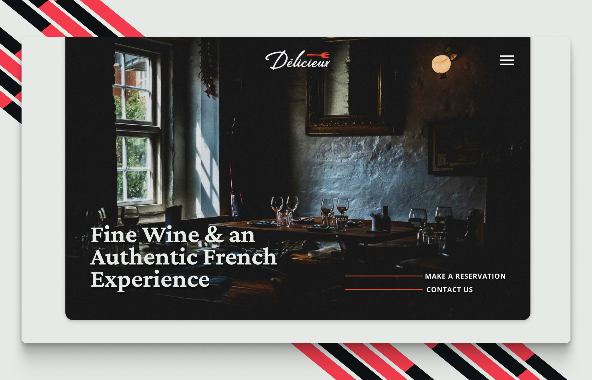

# Délicieux

> A multi-page website for a mock restaurant named Délicieux.

### Built Using

[![React][React]][React-url] [![Astro][Astro.js]][Astro-url] [![TypeScript][TypeScript]][TypeScript-url] [![Tailwind][Tailwindcss]][Tailwindcss-url] [![TinaCMS][TinaCMS]][TinaCMS-url]

## Purpose

I wanted to work on improving my design skills in Figma while also starting to utilize a headless CMS in my code. I didn't originally plan on using Astro, but came to learn quite a bit about it despite mainly just writing React components. The ease of using the View Transitions API in Astro was a definite plus.

[TinaCMS]: https://img.shields.io/badge/tina-EC4815?style=for-the-badge&logo=tina&logoColor=EC4815&color=black
[TinaCMS-url]: https://tina.io
[React]: https://img.shields.io/badge/react-61DAFB?style=for-the-badge&logo=react&logoColor=61DAFB&color=black
[React-url]: https://react.dev
[TypeScript]: https://img.shields.io/badge/typescript-3178C6?style=for-the-badge&logo=typescript&logoColor=3178C6&color=black
[TypeScript-url]: https://typescriptlang.org
[Astro.js]: https://img.shields.io/badge/astro-BC52EE?style=for-the-badge&logo=astro&logoColor=BC52EE&color=black
[Astro-url]: https://astro.build
[Tailwindcss]: https://img.shields.io/badge/tailwindcss-06B6D4?style=for-the-badge&logo=tailwindcss&logoColor=06B6D4&color=black
[Tailwindcss-url]: https://tailwindcss.com/
